# Adam Lamers

## Terraform

Infrastruktura została zbudowana przy użyciu Terraform. Struktura projektu została podzielona na dwie części:

- Przygotowywanie instancji EC2 i konfiguracja sieci
- Pobranie obrazów na tej instancji i uruchomienie kontenerów

## AWS

### Dostawca AWS dla terraform

Do zarządzania zasobami w AWS użyłem oficjalnego 'provider-a' stworzonego dla tego serwisu

- **hashicorp/aws**

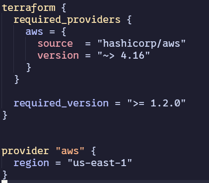

### Konfiguracja sieci

W celu konfiguracji sieci stworzone zostały następujące zasoby:

#### VPC

VPC jest wirtualną siecią, która pozwala na izolację zasobów w chmurze.
W ramach tej sieci możemy tworzyć bramy domyślne, podsieci i reguły bezpieczeństwa

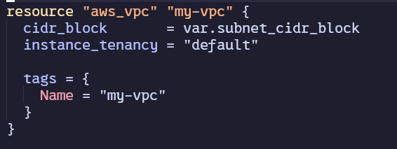

#### Reguły bezpieczeństwa

Reguły bezpieczeństwa pozwalają na kontrolę ruchu sieciowego do i z zasobów w VPC.
Można go porównać do firewalla dla zasobów w chmurze.

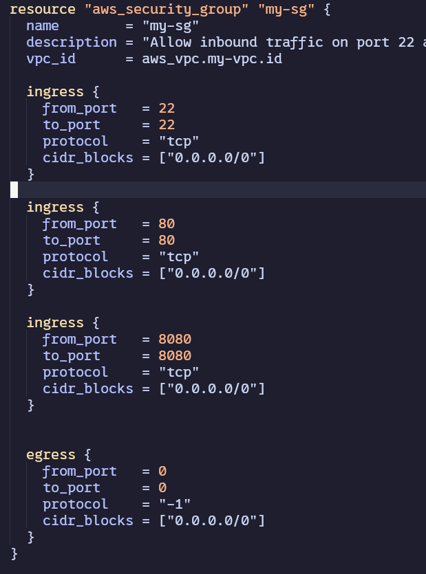

W tym przypadku otwarte zostały porty 80 i 8080 na ruch wejściowy związany z aplikacją
Do celów testowych otworzono również port 22 dla ruchu SSH.
Zostały również otwarte wszystkie porty dla ruchu wychodzącego aby umożliwić komunikację z zewnętrznymi serwisami.

#### Brama domyślna

Brama domyślna pozwala na komunikację z zasobami w innych sieciach i zasobami w Internecie.
Jest ona związana z VPC i pozwala na przekazywanie ruchu sieciowego z i do zasobów w VPC.
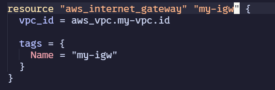

#### Tablica routingu

Tablica routingu określa, gdzie ruch sieciowy ma być kierowany. W tym przypadku definiujemy,
powiązanie między podsieciami a bramą domyślną.
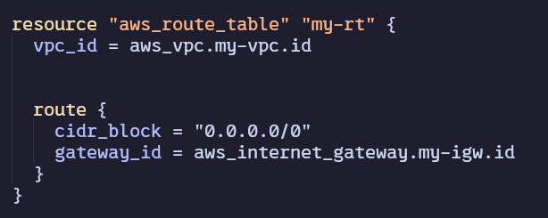

#### Podsieć i asocjacja podsieci z tablicą routingu

Aby powiązać podsieć z tablicą routingu, tworzymy asocjację podsieci z tablicą routingu.

### Instancja EC2

#### AMI

Aby stworzyć instancje EC2 użyłem obrazu amazon linux na podstawie zasobu data "aws_ami" zamiast sztywnego id obrazu.
Pozwala to na elastyczność w wyborze obrazu, który chcemy użyć.
Obraz ten był łatwo dostępny i spełniał wymogi ćwiczenia.

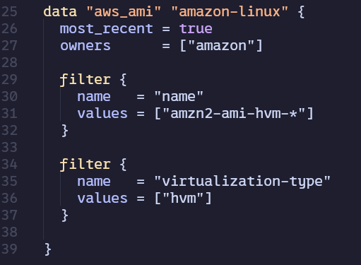

#### Klucze SSH

Aby diagnozować i testować instancje EC2 dodano klucze SSH do instancji.

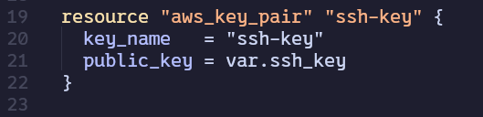

#### Instancja EC2

Stworzenie zasobu instancji zawiera informacje o wybranym obrazie,
typ instancji (t2.micro),
kluczach SSH, sieci i regułach bezpieczeństwa.

Dodatkowo w danych użytkownika został przekazany skrypt, który instaluje demona i klienta Dockera na instancji.
Jest to wymagane do późniejszego użycia dostawcy Dockera w Terraformie na tej instancji

## Docker

Po zainicjalizowaniu instancji EC2 i skonfigurowaniu sieci, uruchamiana jest procedura ustawiania kontenerów Dockera na tej instancji

### Docker provider

Do budowania i zarządzania kontenerami Dockera użyłem dostawcy Dockera dla Terraform:
`kreuzwerker/docker`

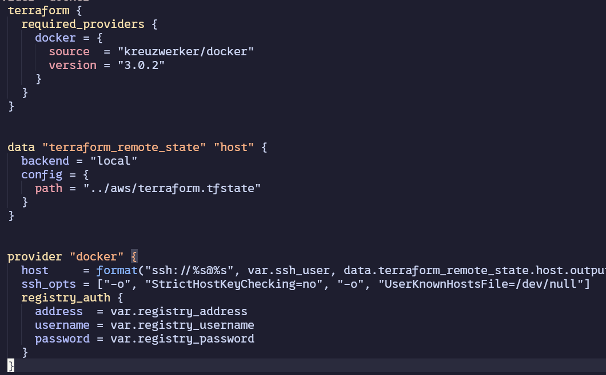

Niestety nie byłem w stanie uruchomić inicjalizacji Dockera razem z instancją EC2, ponieważ nie można uruchomić Dockera na instancji EC2, ze względu na wymogi dostawcy dockera aby w fazie planowania otrzymać adres instacji na której ma postawić kontenery (co nie jest możliwe kiedy serwer jest stawiany przez wcześniejszy krok)

Aby rozwiązać ten problem zastosowałem następujące podejście:

- Stworzenie instancji EC2
- Zapisanie adresu IP nowo utworzonej instancji do outputu części odpowiedzialnej za AWS
- Wczytanie lokalnego backendu z części odpowiedzialnej za AWS, aby uzyskać adres IP instancji
- Przekazanie tak uzyskanego adresu IP do dostawcy Dockera

## Docker registry

Aby zbliżyć się do produkcyjnego podejścia, zdecydowałem się na użycie prywatnego rejestru Dockera hostowanego na prywatnym VPSie
Aby uzyskać dostęp do tego registry, należy przekazać dane logowania i sam adres instancji

## Logiczny podział modułów Dockera

Projekt Dockera został podzielony na logiczne moduły aplikacji odpowiedzialne za kolejno:

- stworzenie sieci dockera

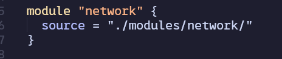

- stworzenie kontenera z aplikacją backendową

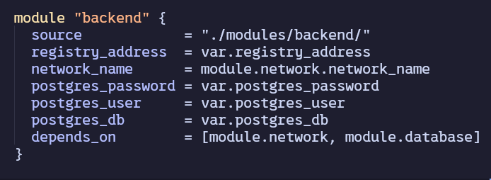

- stworzenie kontenera z aplikacją frontendową

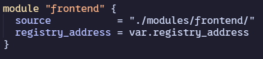

- stworzenie kontenera z bazą danych

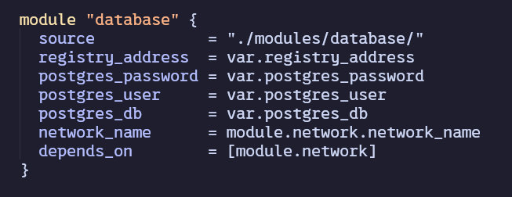

- stworzenie kontenera z Watchtowerem (do automatycznego aktualizowania kontenerów po zmianie obrazów w registry)

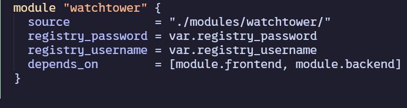

## Przykład tworzenie kontenera z backendem

Konfiguracja jest praktycznie przemapowaniem konfiguracji z docker-compse,
wykorzystującą obrazy z prywatnego registry

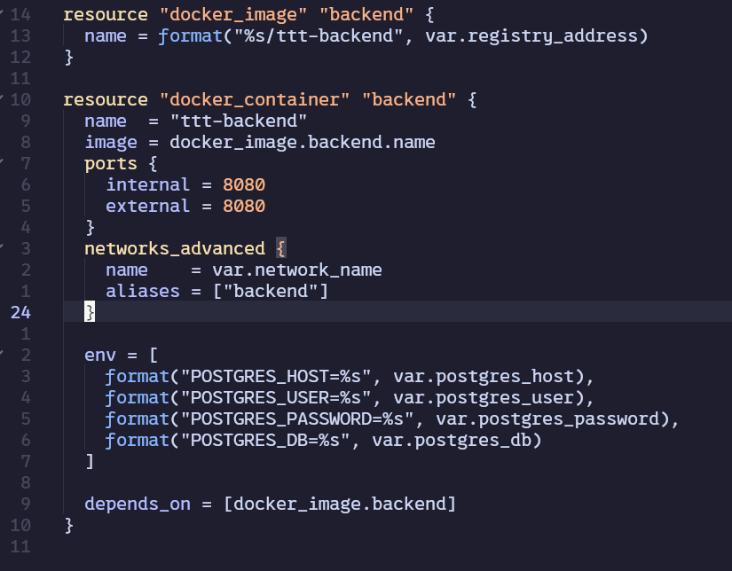

## Budowanie obrazów frontendu

Tak stworzona infrastruktura nie posiada proxy ze stałym adresem IP,
więc przy każdym postawieniu infrastruktury, adres IP instancji EC2 jest inny, zatem obraz
frontendu musi być budowany na nowo przy każdym uruchomieniu aby podać poprawny adres backendu.

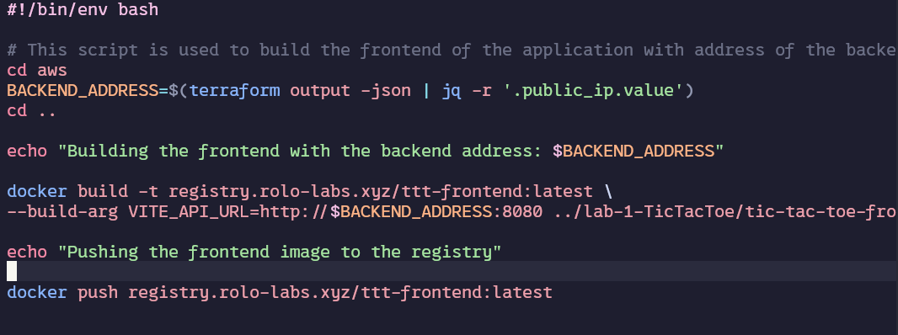

# Uruchamianie infrastruktury

Aby uruchomić infrastrukturę został napisany skrypt zdefiniowany w Makefile

Skrypt ten tworzy infrastrukture AWS, buduje frontend z nowym adresem i pushuje go do registry
oraz uruchamia kontenery Dockera na instancji EC2

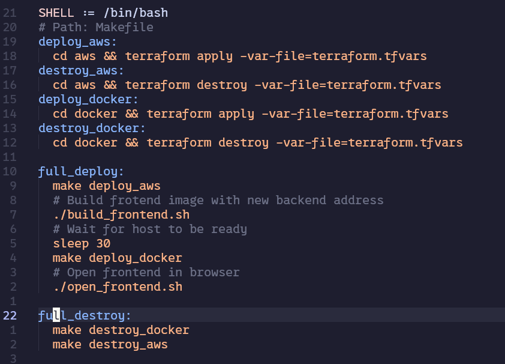

Zasoby zostały podzielone na tematyczne moduły, oraz dwa podprojekty (AWS i Docker):

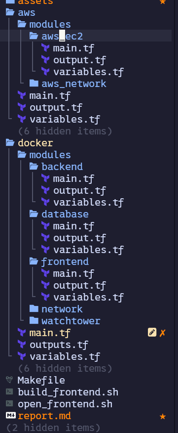
